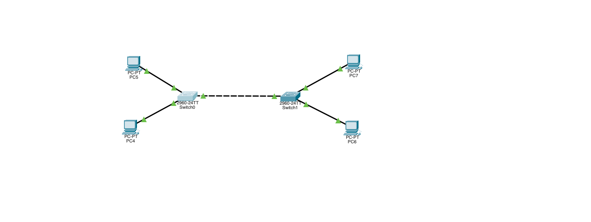
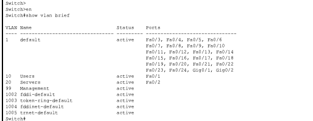
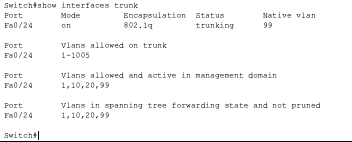
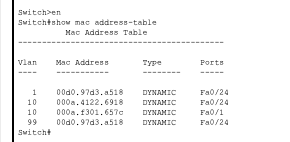
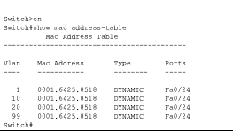
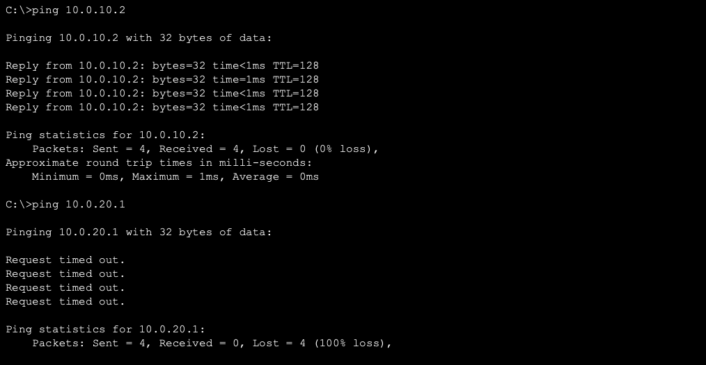

# Day 1 — VLANs & Switching

## What I Learned
- VLANs split one physical switch into separate broadcast domains
- Access ports are for end devices — one VLAN per port
- Trunk ports carry multiple VLANs between switches using 802.1Q tags
- The native VLAN is sent untagged across the trunk — both sides need to match
- Switches learn MAC addresses dynamically by looking at the source MAC of incoming frames

## Lab Goal
Build three VLANs across two switches and prove isolation works:
- VLAN 10 = Users
- VLAN 20 = Servers
- VLAN 99 = Management

## Topology



Two 2960 switches connected with a crossover cable on Fa0/24. Four PCs on straight-through cables.

| Device | Switch | Port | VLAN | IP Address |
|--------|--------|------|------|------------|
| PC4 | SW0 | Fa0/1 | 10 (Users) | 10.0.10.1/24 |
| PC5 | SW0 | Fa0/2 | 20 (Servers) | 10.0.20.1/24 |
| PC6 | SW1 | Fa0/1 | 10 (Users) | 10.0.10.2/24 |
| PC7 | SW1 | Fa0/2 | 20 (Servers) | 10.0.20.2/24 |

## What I Configured

Created VLANs on both switches:
```
config t
vlan 10
name Users
exit
vlan 20
name Servers
exit
vlan 99
name Management
end
```

Assigned access ports (both switches):
```
config t
interface fa0/1
switchport mode access
switchport access vlan 10
exit
interface fa0/2
switchport mode access
switchport access vlan 20
end
```

Set up the trunk on Fa0/24 (both switches):
```
config t
interface fa0/24
switchport mode trunk
switchport trunk native vlan 99
end
```

## What I Verified

### show vlan brief


Fa0/1 moved to VLAN 10, Fa0/2 moved to VLAN 20. Everything else stayed in VLAN 1.

### show interfaces trunk


Fa0/24 is trunking with 802.1Q. Native VLAN is 99. VLANs 1, 10, 20, 99 are all being carried.

### show mac address-table



Local PCs show up on their access ports. Remote PCs show up on Fa0/24 because that's the trunk — the switch learned their MACs through it.

### Ping Tests


- PC4 → PC6 (both VLAN 10): **works** — 4/4 replies
- PC4 → PC5 (different VLANs): **fails** — request timed out, 100% loss

This proves VLANs are isolating traffic. No Layer 3 device means no cross-VLAN communication.

## Issues I Ran Into
- Got a **native VLAN mismatch** error when I configured the trunk on SW0 first — SW0 had native VLAN 99 but SW1 was still on the default (VLAN 1). Fixed it by setting native VLAN 99 on both sides.
- The MAC address table on SW1 was empty at first — had to ping from the PCs before the switch learned their addresses.

## Practice Checklist
- [x] Create VLAN 10, 20, and 99
- [x] Assign ports to the correct VLANs
- [x] Verify trunking between switches
- [x] Confirm the MAC address table updates
